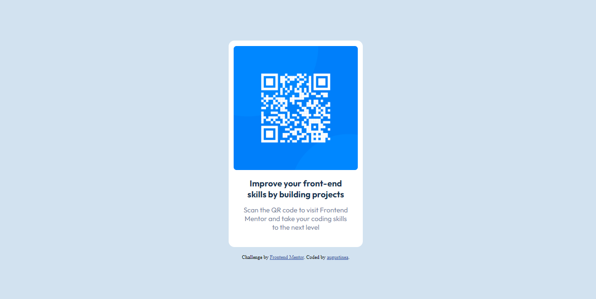

# Frontend Mentor - QR code component solution

This is a solution to the [QR code component challenge on Frontend Mentor](https://www.frontendmentor.io/challenges/qr-code-component-iux_sIO_H). Frontend Mentor challenges help you improve your coding skills by building realistic projects.

## Table of contents

-   [Overview](#overview)
    -   [Screenshot](#screenshot)
    -   [Links](#links)
-   [My process](#my-process)
    -   [Built with](#built-with)
-   [Author](#author)

## Overview

### Screenshot

### Links

-   Solution URL: [https://github.com/augustine-a8/qr-code-component-fr-mentor.git](https://github.com/augustine-a8/qr-code-component-fr-mentor.git)
-   Live Site URL: [https://augustine-a8.github.io/qr-code-component-fr-mentor/](https://augustine-a8.github.io/qr-code-component-fr-mentor/)

## My process

### Built with

-   HTML
-   CSS

## Author

-   Frontend Mentor - [@augustine-a8](https://www.frontendmentor.io/profile/augustine-a8)
